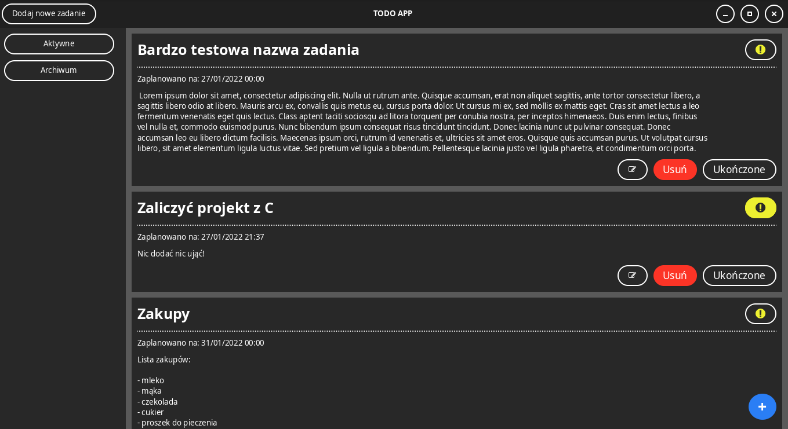

# GTK TODO APP - Projekt zaliczeniowy z języka C


## Spis treści:
1. [Kilka słów o projekcie](#kilka-słów-o-projekcie)
2. [Zależności](#zależności)
3. [Struktura projektu](#struktura-projektu)
4. [Kompilacja i użytkowanie programu](#kompilacja-i-użytkowanie-programu)

## Kilka słów o projekcie

Przy wyborze tematu projektu kierowałem się głównie chęcią nauczenia się biblioteki do tworzenia interfejsów graficznych, jaką jest GTK. Todo-like aplikacja była pierwszym pomysłem, który wpadł mi do głowy. Chciałem go zrealizować, ponieważ opiera sie na prostych założeniach i będzie dobrym początkiem do pisania poważniejszych programów w przyszłości. GTK nie jest jedyną biblioteką, z której skorzystałem. Zapis i odczyt zadań jest oparty o bazę danych. Wybór padł tutaj na sqlite3, ponieważ nie wymaga żadnej konfiguracji, a co za tym idzie użytkownik programu nie jest zmuszony do podejmowania żadnych dodatakowych kroków przed jego uruchomieniem. Jako dodatkowe ćwiczenie napisałem także wersję aplikacji sterowaną z wiersza poleceń. Interfejs graficzny doczekał się także swojego własnego arkusza stylów.

## Zależności

Do poprawnego działania programu wymagane są poniższe zależności:

- [GTK4](https://gitlab.gnome.org/GNOME/gtk)
- [sqlite3](https://www.sqlite.org/index.html)
- [make](https://www.gnu.org/software/make/)
- [gcc](https://gcc.gnu.org/)

Wszystkie z powyższych zależności dostępne są chyba dla każdej dystrybucji GNU/Linuxa.

## Struktura projektu
```
├── bin
├── compile_commands.json
├── Makefile
├── obj
├── README.md
├── src
│   ├── activate.c
│   ├── cli_handling.c
│   ├── db_init.c
│   ├── include
│   │   ├── activate.h
│   │   ├── cli_handling.h
│   │   ├── db_init.h
│   │   ├── messages.h
│   │   ├── structs.h
│   │   ├── task_handling.h
│   │   └── task_loading.h
│   ├── main.c
│   ├── messages.c
│   ├── task_handling.c
│   └── task_loading.c
└── style.css
```

Skrótowy opis poszczególnych plików:
- compile_commands.json - plik potrzebny do pracy z [clangd](https://clangd.llvm.org/) i moim edytorem tekstu [nvim-code](https://gitea.shintenza.tk/Shintenza/nvim-code.git)
- activate.c - tutaj tworzona jest baza interfejsu graficznego 
- db_init.c - plik odpowiedzialny za inicjalizację bazy danych
- cli_handling.c - wersja cli programu
- messages.c - zawiera treść wiadomości wysłanej po użyciu --help
- main.c - inicjalizacja biblioteki graficznej, uruchamianie gui/cli
- task_handling.c - plik odpowiedzialny za wszelkie działania związane z dodawaniem/usuwaniem/edytowaniem zadań
- task_loading.c - plik odpowiedzialny za ładowanie zadań z bazy danych
- style.css - tutaj zdefiniowany jest wygląd poszczególnych widgetów interfejsu graficznego

## Kompilacja i użytkowanie programu

Przed przystąpieniem do kompilacji projektu zainstaluj wymagane zależności:

ArchLinux:
> sudo pacman -S sqlite gtk4 make gcc

Debian:
> sudo apt install libsqlite3-dev libgtk-4-dev make gcc

Po zainstalowaniu odpowiednich zależności należy uruchomić komendę make w głównym folderze projektu. Plik binarny znajduje się w folderze bin. Uruchomienie tego pliku bez żadnych argumentów, wystartuje graficzną wersję aplikacji. Podanie argumentów skutkuje uruchomieniem wersji cli programu:

```
./bin/c_todo --help
Użycie:
    [Opcje] [Flagi wybranej opcji]

[Opcje]
    -a, -A dodawanie nowego zadania
        [Flagi wybranej opcji]
            -t(wymagane) "Nazwa zadania"
            -d(wymagane) "Opis zadania"
            -tm(wymagane) "czas wykonania zadania format 'dd\mm\rrrr\gg:mm'"

            [Przykładowe użycie]
                c_todo -A -t "Zaliczenie projektu z języka C" -d "Przykładowy opis zadania" -tm "28\12\2021\21:37"
    -l, L wyświetlanie zadań
            -a (domyślne) - wyświetla aktywne zadania
            -o - wyświetla zadania archiwalne
            -v - wyświetla szczegółowe informacje o zadaniu
    -d, D archiwizowanie/kasowanie zadań
            -n (domyślne) - archiwizowanie po numerze zadania (dotyczy zadań aktywnych)
            -b - archiwizowanie po id z bazy danych (jeżeli podano id zadania ukończonego zostanie ono usunięte na stale z bazy)
            -Ao - kasowanie wszystkich zadań archiwalnych
```
